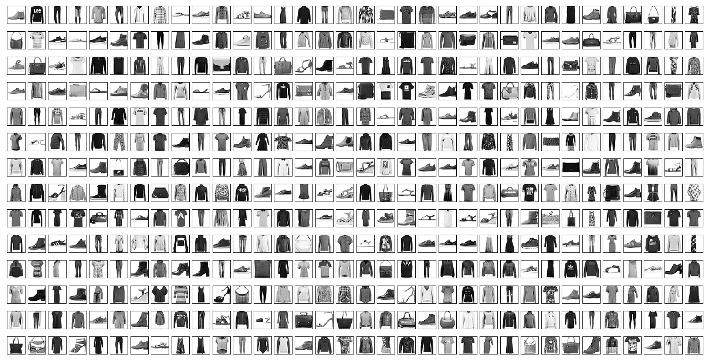

# fashion_mnist.py

This python module provides a simple to use function to download and extract the Fashion-MNIST database of Zalando's article images that is provided in http://fashion-mnist.s3-website.eu-central-1.amazonaws.com/.

**Function:**

    load_FashionMNIST(path=None, normalise=True, flatten=True, onehot=True)

_kwarg:_ 

     path - str: FashionMNIST datasets directory. 
                 Default to current directory/FashionMNIST. 
                 Create if nonexistant. Download any missing files.
     normalise - boolean: yes -> pixels RGB values [0,255] divided by 255.
                          no  -> pixels RGB values [0,255].
     flatten   - boolean: yes -> pixels of each image stored as 1D numpy array.
                          no  -> pixels of each image stored as 2D numpy array.
     onehot    - boolean: yes -> labels stored as one-hot encoded numpy array.
                          no  -> labels values used.

_Returns a nested dictionary:_

     {'train': {'images': train_images, 'labels': train_labels},
      'test': {'images': test_images, 'labels': test_labels}}
     where,
      train_images = FashionMNISTimages(magic_number=2051, nimages=60000,
                                        nrows=28, ncols=28, pixels=np.array())
            if normalise, pixels dtype='float32' & [0.0(white), 1.0(black)]
            else,         pixels.dtype='uint8' & [0(white), 255(black)]
            if flatten,   pixels.shape=(60000, 784)
            else,         pixels.shape=(60000, 28, 28)
      train_labels = FashionMNISTlabels(magic_number=2049, nlabels=60000,
                                        labels=np.array() dtype='uint8')
            if onehot,    labels.shape=(60000, 10)
            else,         labels.shape=(60000,)
      test_images = FashionMNISTimages(magic_number=2051, nimages=10000,
                                       nrows=28, ncols=28, pixels=np.array())
            if normalise, pixels dtype='float64' & [0.0(white), 1.0(black)]
            else,         pixels dtype='uint8' & [0(white), 255(black)]
            if flatten,   pixels.shape=(10000, 784)
            else,         pixels.shape=(10000, 28, 28)
      test_labels = FashionMNISTlabels(magic_number=2049, nlabels=10000,
                                       labels=np.array() dtype='uint8')
            if onehot,    labels.shape=(10000, 10)
            else,         labels.shape=(10000,)
*Remarks:*

`FashionMNISTimages()` and `FashionMNISTlabels()` are [dataklass objects](https://github.com/dabeaz/dataklasses). On my system, they performed ~25x faster than python3 built-in [dataclass objects](https://docs.python.org/3/library/dataclasses.html) and 5x faster than [namedtuple](https://docs.python.org/3/library/collections.html?highlight=namedtuple#collections.namedtuple). 

# How to use?

    from fashion_mnist import load_FashionMNIST  # Import function from module
    fmdb = load_FashionMNIST()                   # Get FashionMNIST database using default settings
    train_images = fmdb['train']['pixels']       # A 60000x784 numpy array with float32 values    
    train_labels = fmdb['train']['labels']       # A 60000x10 numpy array with uint8 values
    test_images = fmdb['train']['pixels']        # A 10000x784 numpy array with float32 values    
    test_labels = fmdb['train']['labels']        # A 10000x10 numpy array with uint8 values